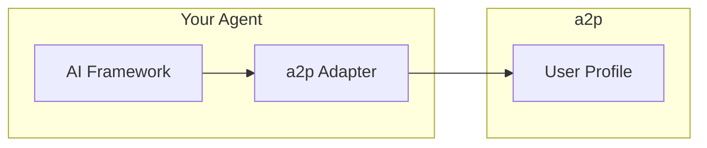

# Framework Adapters

a2p provides ready-to-use adapters for popular AI frameworks.

---

## Available Adapters

| Framework | Language | Package | Status |
|-----------|----------|---------|--------|
| [LangChain](langchain.md) | TypeScript | `@a2p/langchain` | ✅ Stable |
| [LangChain](langchain.md) | Python | `a2p-langchain` | ✅ Stable |
| [OpenAI Assistants](openai.md) | TypeScript | `@a2p/openai` | ✅ Stable |
| [LangGraph](langgraph.md) | TypeScript | `@a2p/langgraph` | ✅ Stable |
| [CrewAI](crewai.md) | Python | `a2p-crewai` | ✅ Stable |

---

## How Adapters Work

Adapters provide native integration with each framework:



### What Adapters Do

1. **Read user context** — Fetch profile data for personalization
2. **Inject into prompts** — Add user preferences to system prompts
3. **Propose memories** — Learn from conversations
4. **Handle consent** — Respect user policies

---

## Quick Start

=== "LangChain (TS)"

    ```typescript
    import { A2PLangChainMemory } from '@a2p/langchain';
    
    const memory = new A2PLangChainMemory({
      userDid: 'did:a2p:user:local:alice',
      agentDid: 'did:a2p:agent:local:my-agent',
      scopes: ['a2p:preferences', 'a2p:interests']
    });
    
    const chain = new ConversationChain({
      llm: new ChatOpenAI(),
      memory
    });
    ```

=== "LangChain (Python)"

    ```python
    from a2p_langchain import A2PLangChainMemory
    
    memory = A2PLangChainMemory(
        user_did="did:a2p:user:local:alice",
        agent_did="did:a2p:agent:local:my-agent",
        scopes=["a2p:preferences", "a2p:interests"]
    )
    
    chain = ConversationChain(
        llm=ChatOpenAI(),
        memory=memory
    )
    ```

=== "OpenAI Assistants"

    ```typescript
    import { A2POpenAIAdapter } from '@a2p/openai';
    
    const adapter = new A2POpenAIAdapter({
      userDid: 'did:a2p:user:local:alice',
      agentDid: 'did:a2p:agent:local:my-agent'
    });
    
    // Get enhanced system instructions
    const instructions = await adapter.getSystemInstructions();
    ```

=== "CrewAI"

    ```python
    from a2p_crewai import A2PCrewMemory
    
    memory = A2PCrewMemory(
        user_did="did:a2p:user:local:alice",
        agent_did="did:a2p:agent:local:my-agent"
    )
    
    agent = Agent(
        role="Assistant",
        memory=memory
    )
    ```

---

## Common Patterns

### Reading User Context

All adapters load user preferences:

```typescript
// Context is automatically loaded
const preferences = memory.getPreferences();
// { language: "en-US", style: "concise" }
```

### Proposing Memories

Adapters can propose memories from conversations:

```typescript
// After a conversation turn
await memory.proposeMemory(
  "User prefers detailed explanations for technical topics",
  { category: "a2p:preferences.communication", confidence: 0.8 }
);
```

### Respecting Consent

Adapters automatically respect user policies:

```typescript
// Only returns data the agent is allowed to see
const profile = await memory.loadProfile();
// Health data excluded if denied by policy
```

---

## Building Custom Adapters

If your framework isn't supported, you can build a custom adapter:

```typescript
import { A2PClient } from '@a2p/sdk';

class MyFrameworkAdapter {
  private client: A2PClient;
  private userDid: string;
  
  constructor(config: { userDid: string; agentDid: string }) {
    this.userDid = config.userDid;
    this.client = new A2PClient({ agentDid: config.agentDid });
  }
  
  async getContext(): Promise<Record<string, any>> {
    const profile = await this.client.getProfile({
      userDid: this.userDid,
      scopes: ['a2p:preferences']
    });
    return profile.common.preferences;
  }
  
  async learn(content: string, category: string): Promise<void> {
    await this.client.proposeMemory({
      userDid: this.userDid,
      content,
      category,
      confidence: 0.8
    });
  }
}
```

---

## Next Steps

- [LangChain Adapter](langchain.md) — Full LangChain guide
- [OpenAI Adapter](openai.md) — OpenAI Assistants guide
- [SDK Reference](../sdk/typescript.md) — Build custom adapters
