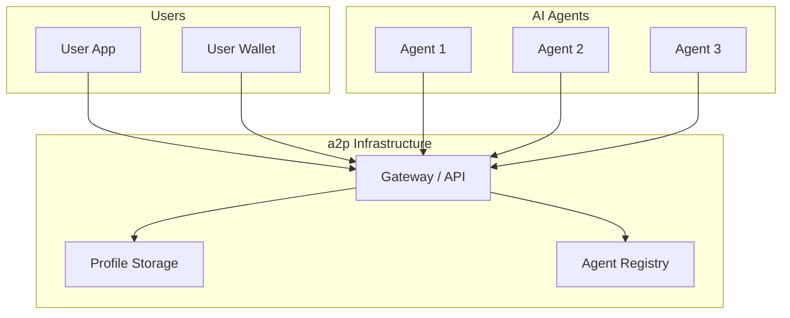
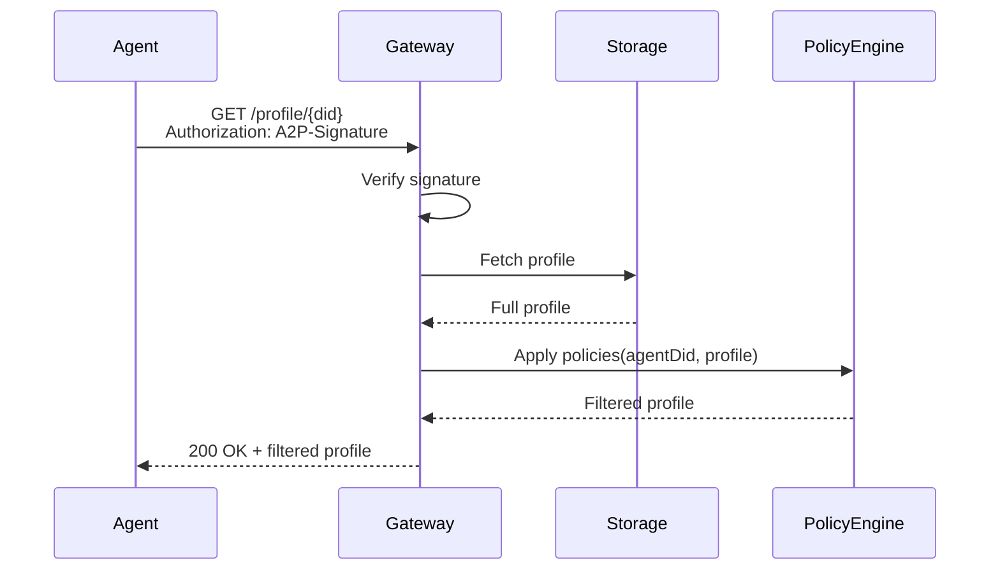
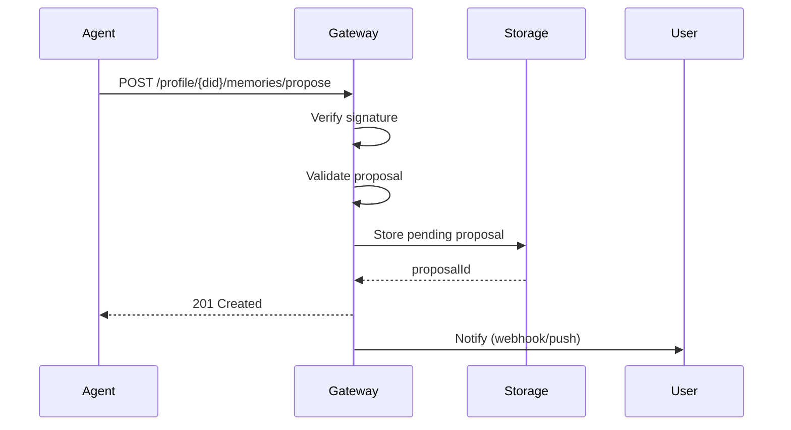
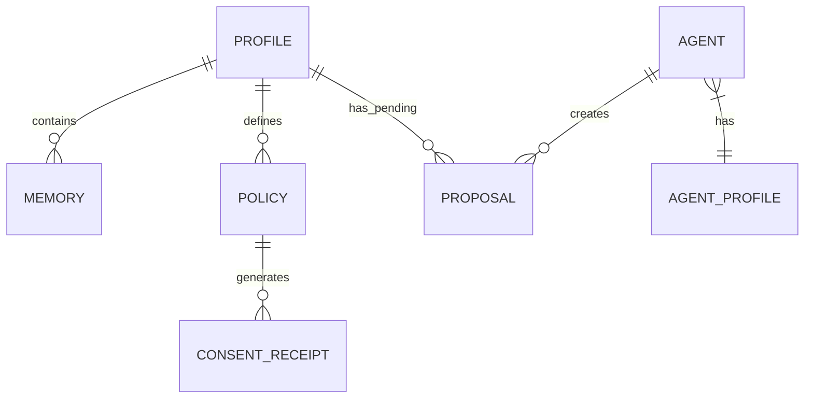
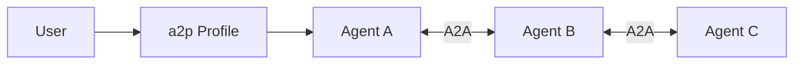

# Architecture

This page describes the high-level architecture of the a2p protocol.

---

## System Overview



---

## Core Components

### 1. User Profile

The central data structure owned by the user:

```
┌─────────────────────────────────────────┐
│              User Profile               │
├─────────────────────────────────────────┤
│ Identity        │ DID, display name     │
│ Preferences     │ Language, style       │
│ Memories        │ Categorized facts     │
│ Policies        │ Consent rules         │
│ Pending         │ Proposals to review   │
└─────────────────────────────────────────┘
```

### 2. Gateway / API

Handles all protocol operations:

- Profile retrieval (with access control)
- Access requests (with purpose)
- Memory proposals
- Consent management

### 3. Profile Storage

Pluggable storage backends:

| Option | Use Case |
|--------|----------|
| **Local** | User's device |
| **Cloud** | Managed service |
| **Decentralized** | IPFS, Solid pods |

### 4. Agent Registry

Optional directory of verified agents:

- Agent profiles and capabilities
- Trust/reputation information
- Certification status

---

## Request Flow

### Reading a Profile



### Proposing a Memory



---

## Data Model

### Profile Schema

```json
{
  "id": "did:a2p:user:local:...",
  "version": "1.0",
  "profileType": "human",
  "created": "2025-01-01T00:00:00Z",
  "updated": "2025-12-25T10:00:00Z",
  
  "identity": { ... },
  "common": {
    "preferences": { ... },
    "interests": { ... }
  },
  "memories": {
    "a2p:professional": { ... },
    "a2p:episodic": [ ... ]
  },
  "accessPolicies": [ ... ],
  "pendingProposals": [ ... ]
}
```

### Relationships



---

## Security Architecture

### Defense in Depth

```
┌─────────────────────────────────────────────────────────────┐
│                    Layer 1: Network                         │
│  TLS 1.3, WAF, DDoS mitigation                             │
├─────────────────────────────────────────────────────────────┤
│                    Layer 2: Transport                       │
│  Rate limiting, IP filtering                               │
├─────────────────────────────────────────────────────────────┤
│                    Layer 3: Authentication                  │
│  DID signatures, nonce validation, timestamp checks        │
├─────────────────────────────────────────────────────────────┤
│                    Layer 4: Authorization                   │
│  Consent policies, scope checking, purpose validation      │
├─────────────────────────────────────────────────────────────┤
│                    Layer 5: Data Protection                 │
│  Encryption at rest, encryption in transit                 │
└─────────────────────────────────────────────────────────────┘
```

### Key Management

Users control cryptographic keys:

- **Primary key** — Signs all operations
- **Recovery key** — Backup for key loss
- **Delegation keys** — For specific agents

---

## Deployment Options

### Option 1: Self-Hosted

User runs their own profile storage:

```
User Device
├── a2p Client
├── Local Storage
└── DID Keys
```

### Option 2: Managed Service

Profile hosted by a2p-compatible provider:

```
a2p Cloud
├── Gateway
├── Storage
└── User Dashboard
```

### Option 3: Hybrid

Local for sensitive, cloud for convenience:

```
User Device (sensitive)          Cloud (general)
├── Health data                  ├── Preferences
├── Financial data               ├── Interests
└── Private keys                 └── General memories
```

---

## Interoperability

### With A2A Protocol

a2p complements [A2A (Agent2Agent)](https://a2a-protocol.org/):



- **a2p**: Agent accesses user context
- **A2A**: Agents communicate with each other

### With MCP

a2p profiles can be exposed as MCP resources:

```
MCP Server
└── a2p Resource Provider
    ├── profile://user/preferences
    └── profile://user/context
```

---

## Scalability

### Horizontal Scaling

```
Load Balancer
├── Gateway 1 ──┐
├── Gateway 2 ──┼── Storage Cluster
└── Gateway 3 ──┘
```

### Caching Strategy

| Data | Cache TTL | Invalidation |
|------|-----------|--------------|
| Public profile | 1 hour | On update |
| Policies | 5 minutes | On change |
| Agent registry | 1 hour | On verification |

### Rate Limits

| Operation | Limit |
|-----------|-------|
| Profile reads | 100/hour |
| Proposals | 20/hour |
| Policy updates | 10/hour |

---

## Next Steps

- [Specification Overview](../spec/overview.md) — Detailed protocol spec
- [Security Spec](../spec/security.md) — Security details
- [Quickstart](../tutorials/quickstart-typescript.md) — Build an integration
