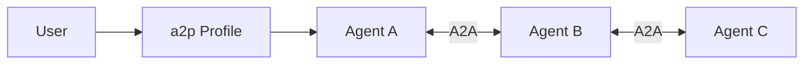
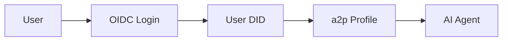

# Comparison with Other Solutions

How does a2p compare to existing protocols and solutions?

---

## Quick Comparison

| Feature | a2p | A2A | MCP | Solid | OpenID Connect | LangChain Memory |
|---------|-----|-----|-----|-------|----------------|------------------|
| **Focus** | User profiles for AI | Agent-to-agent | AI assistant tools | General data pods | Identity federation | Agent memory |
| **User ownership** | ✅ | N/A | N/A | ✅ | ❌ | ❌ |
| **AI-specific** | ✅ | ✅ | ✅ | ❌ | ❌ | ✅ |
| **Portable** | ✅ | ✅ | ✅ | ✅ | ❌ | ❌ |
| **GDPR built-in** | ✅ | ❌ | ❌ | Partial | ❌ | ❌ |
| **AI Act ready** | ✅ | ❌ | ❌ | ❌ | ❌ | ❌ |
| **Open standard** | ✅ | ✅ | ✅ | ✅ | ✅ | ❌ |
| **Relationship** | Core | Complementary | Complementary | Infrastructure | Complementary | Replacement target |

---

## a2p's Role in the Ecosystem

a2p is **NOT a competitor** to A2A, MCP, Solid, or OpenID. Instead, it fills a **unique gap** in the AI agent ecosystem by providing **user-owned profiles** that complement existing protocols.

### Ecosystem Map

```
┌─────────────────────────────────────────────────────────┐
│              AI Agent Ecosystem                          │
├─────────────────────────────────────────────────────────┤
│                                                           │
│  Authentication: OpenID Connect                          │
│       │                                                    │
│       ▼                                                    │
│  Identity: DIDs                                            │
│       │                                                    │
│       ▼                                                    │
│  ┌──────────────────────────────────────┐               │
│  │      a2p: User Profiles                │               │
│  │  (Preferences, Memories, Consent)       │               │
│  └──────────────────────────────────────┘               │
│       │                                                    │
│       ├──────────┬──────────┬──────────┬──────────┐       │
│       ▼          ▼          ▼          ▼          ▼       │
│    A2A        MCP       Solid      LangChain   Others    │
│  (Agent     (AI Tools) (Storage)   (Memory)               │
│   Comm)                                                    │
└─────────────────────────────────────────────────────────┘
```

---

## a2p vs A2A Protocol

[A2A (Agent2Agent)](https://a2a-protocol.org/) is Google's protocol for agent communication, now part of the Linux Foundation.

### Different Focus - Complementary, NOT Competitive

| Aspect | a2p | A2A |
|--------|-----|-----|
| **Purpose** | User context for agents | Agent-to-agent communication |
| **Data** | User preferences, memories | Tasks, messages between agents |
| **Owner** | User | Agents/platforms |
| **Flow** | Agent → Profile → Agent | Agent ↔ Agent |
| **Question** | "What should agents know about the user?" | "How do agents talk to each other?" |

### Complementary Integration

They work together seamlessly:



1. Agent A loads user profile from a2p
2. Agent A communicates with Agents B and C via A2A
3. User context travels in A2A message metadata
4. All agents respect user preferences throughout the interaction

### Integration Status

✅ **Already Integrated**: The `a2p-a2a` adapter is implemented and documented. User context automatically flows through A2A messages.

### Example Use Case

A travel planning scenario:

1. **a2p**: User profile provides travel preferences, budget, dietary restrictions
2. **A2A**: Travel agent coordinates with flight, hotel, and restaurant agents
3. **Integration**: User preferences embedded in A2A messages ensure all agents respect user constraints
4. **Result**: Personalized trip based on user profile, with all agents aware of preferences

**Key Message**: a2p is the **user profile layer** that A2A agents need. Without a2p, A2A agents have no standardized way to access user context.

---

## a2p vs Solid Project

[Solid](https://solidproject.org/) is Tim Berners-Lee's project for decentralized data ownership.

### Synergy, Not Competition

**Key Insight**: Solid provides **infrastructure** (storage), while a2p provides **application layer** (AI profiles). They are **complementary**.

### Similarities

| Both have | Description |
|-----------|-------------|
| User data ownership | Users control their data |
| Decentralized identity | Not tied to platforms |
| Data portability | Move between providers |
| Open standards | W3C-aligned |

### Differences and Complementarity

| Aspect | a2p | Solid |
|--------|-----|-------|
| **Layer** | Application (profiles) | Infrastructure (storage) |
| **Scope** | AI agent profiles specifically | General-purpose data pods |
| **Complexity** | Focused, simpler | More comprehensive, complex |
| **AI features** | Memory proposals, agent policies | Generic, needs extension |
| **Adoption focus** | AI developers | General web developers |
| **Compliance** | GDPR/AI Act native | General privacy focus |

### Integration Opportunity

**a2p can use Solid Pods as storage backend:**

```
┌─────────────────┐
│   a2p Profile    │
│  (Schema/Data)   │
└────────┬────────┘
         │
         ▼
┌─────────────────┐
│   Solid Pod     │
│  (Storage)      │
└─────────────────┘
```

**Benefits:**
- ✅ Users can store a2p profiles in their Solid Pods
- ✅ Leverages Solid's decentralized infrastructure
- ✅ a2p brings AI-specific features to Solid ecosystem
- ✅ Solid users can use a2p for AI agent profiles

**Status**: ✅ **Implemented** - `SolidStorage` backend available in SDK. See [Solid integration example](../../../../examples/frameworks/solid/python/).

### When to Use Which

- **Solid**: Building a general decentralized app, need general data storage
- **a2p**: Building AI agents that need user context
- **Together**: Store a2p profiles in Solid Pods for maximum decentralization

---

## a2p vs OpenID Connect

[OpenID Connect](https://openid.net/connect/) is the standard for identity federation.

### Different Layers - Complementary, NOT Competitive

**Key Insight**: OpenID Connect handles **authentication** ("who are you?"), while a2p handles **profile data** ("what are your preferences?"). They operate at **different layers** and are **complementary**.

### Different Purposes

| Aspect | a2p | OpenID Connect |
|--------|-----|----------------|
| **Layer** | Profile data | Authentication |
| **Purpose** | AI profile access | Identity verification |
| **What it shares** | Preferences, context, memories | Identity claims (name, email) |
| **Control** | Per-agent policies | Per-app consent |
| **AI-specific** | ✅ | ❌ |
| **Question** | "What should agents know about you?" | "Who are you?" |

### Complementary Integration

**Typical Flow:**



1. **OpenID Connect**: User authenticates ("I am Alice")
2. **DID Mapping**: OIDC identity maps to user DID
3. **a2p Profile**: Agent accesses user's preferences, memories, consent policies
4. **Result**: Authenticated user with personalized AI experience

**Integration Status**: ✅ **Example available** - See [OIDC integration example](../../../../examples/frameworks/oidc/python/). OIDC authentication integration in Gaugid is planned.

**Key Message**: OpenID answers "who are you?", a2p answers "what should I know about you?". They work together, not against each other.

---

## a2p vs LangChain Memory

[LangChain](https://langchain.com/) provides memory systems for AI agents.

### Key Differences

| Aspect | a2p | LangChain Memory |
|--------|-----|------------------|
| **Ownership** | User owns | Agent/developer owns |
| **Portability** | Across agents | Single agent |
| **Standard** | Open protocol | Library feature |
| **Consent** | Explicit, granular | None |
| **Compliance** | GDPR native | Manual implementation |

### Integration

a2p provides a LangChain adapter:

```python
from a2p_langchain import A2PMemory

# Use a2p as LangChain memory backend
memory = A2PMemory(
    user_did="did:a2p:user:local:alice",
    agent_did="did:a2p:agent:local:my-agent"
)
```

Best of both: LangChain's ecosystem + a2p's user sovereignty.

---

## a2p vs Mem0

[Mem0](https://mem0.ai/) is a memory layer for AI applications.

### Comparison

| Aspect | a2p | Mem0 |
|--------|-----|------|
| **Architecture** | Decentralized, user-owned | Centralized service |
| **Control** | User controls | Developer controls |
| **Standard** | Open protocol | Proprietary API |
| **Self-hosting** | ✅ | Limited |
| **Compliance** | Built-in | Manual |

---

## a2p vs Vector Databases

Some teams use Pinecone, Weaviate, or Chroma for user context.

### Comparison

| Aspect | a2p | Vector DB |
|--------|-----|-----------|
| **Purpose** | User profiles | Similarity search |
| **Ownership** | User | Developer |
| **Structure** | Typed schemas | Vectors |
| **Access control** | Consent policies | App-level |
| **Portability** | ✅ | ❌ |

### Together

a2p for structured profile + Vector DB for semantic search:

```
User Query
    │
    ├── a2p: Get user preferences
    │
    └── Vector DB: Search relevant context
```

---

## Summary Matrix

| Need | Best Solution |
|------|---------------|
| AI agents talking to each other | **A2A** |
| User profiles for AI | **a2p** |
| General decentralized data | **Solid** |
| Authentication | **OpenID Connect** |
| Agent memory (single agent) | **LangChain/Mem0** |
| Semantic search | **Vector DB** |
| User sovereignty + AI | **a2p** ✅ |

---

## Why Choose a2p?

✅ **If you need:**
- User-owned AI profiles
- Portability across AI agents
- Built-in GDPR/AI Act compliance
- Granular consent management
- Open standard with SDKs
- Integration with A2A, MCP, Solid, or LangChain

❌ **If you need:**
- Just agent-to-agent communication → Use **A2A** (but consider a2p for user context)
- General data pods → Use **Solid** (but consider a2p for AI profiles on top)
- Just authentication → Use **OIDC** (but consider a2p for profile data after auth)
- AI assistant tool integration → Use **MCP** (but consider a2p for user profile resources)
- Quick prototype without compliance → Use **Mem0** (but consider a2p for production)

**Remember**: a2p **complements** these solutions. You can use A2A + a2p, MCP + a2p, Solid + a2p, or OIDC + a2p together!

---

## Next Steps

- [What is a2p?](what-is-a2p.md) — Full introduction
- [Core Concepts](core-concepts.md) — Technical deep-dive
- [Quickstart](../tutorials/quickstart-typescript.md) — Start building
