# Consent & Policies

a2p gives users fine-grained control over who can access their data and for what purpose.

---

## Access Control Overview


---

## Access Policies

Policies define who can access what:

```json
{
  "accessPolicies": [
    {
      "id": "policy_001",
      "name": "Work AI Policy",
      "priority": 1,
      "agentPattern": "did:a2p:agent:local:work-*",
      "allow": [
        "a2p:preferences.*",
        "a2p:professional.*"
      ],
      "deny": [
        "a2p:health.*",
        "a2p:financial.*"
      ],
      "permissions": ["read_scoped", "propose"],
      "conditions": {
        "purposeRequired": true,
        "maxRetention": "24h"
      }
    }
  ]
}
```

### Policy Fields

| Field | Description |
|-------|-------------|
| `id` | Unique policy identifier |
| `name` | Human-readable name |
| `priority` | Higher = evaluated first (conflicts resolved by priority) |
| `agentPattern` | Which agents this applies to (supports wildcards) |
| `allow` | Categories/scopes to allow |
| `deny` | Categories/scopes to deny (overrides allow) |
| `permissions` | What actions are permitted |
| `conditions` | Additional requirements |

### Agent Patterns

| Pattern | Matches |
|---------|---------|
| `*` | All agents |
| `did:a2p:agent:local:claude` | Specific agent |
| `did:a2p:agent:local:work-*` | Agents with work- prefix |
| `did:a2p:org:local:mycompany:*` | All agents from an organization |

---

## Permissions

| Permission | Description | Use Case |
|------------|-------------|----------|
| `read_public` | Read only public info | Anonymous/untrusted agents |
| `read_scoped` | Read allowed categories | Normal agent access |
| `read_full` | Read entire profile | Rare, trusted admin tools |
| `propose` | Submit memory proposals | Learning agents |
| `write` | Direct write access | Very rare, user tools only |

### Permission Examples

```json
// Minimal access (view-only)
{ "permissions": ["read_public"] }

// Normal agent
{ "permissions": ["read_scoped", "propose"] }

// Trusted agent
{ "permissions": ["read_scoped", "propose", "write"] }
```

---

## Purpose Requirements

GDPR requires purpose limitation. a2p enforces this:

### Access Request with Purpose

```json
{
  "agentDid": "did:a2p:agent:local:my-agent",
  "userDid": "did:a2p:user:local:alice",
  "scopes": ["a2p:preferences", "a2p:interests"],
  "purpose": {
    "type": "personalization",
    "description": "To tailor responses to your communication preferences",
    "legalBasis": "consent",
    "retention": "session_only",
    "automated": {
      "decisionMaking": false,
      "profiling": false
    },
    "sharing": {
      "thirdParties": false
    }
  }
}
```

### Purpose Types

| Type | Description |
|------|-------------|
| `personalization` | Tailoring responses |
| `recommendation` | Suggesting content |
| `context_enrichment` | Adding context to interactions |
| `analysis` | Understanding user needs |
| `support` | Providing customer support |
| `research` | Anonymized research |
| `compliance` | Legal/regulatory requirements |

### Legal Bases (GDPR Article 6)

| Basis | When to Use |
|-------|-------------|
| `consent` | User explicitly agreed |
| `contract` | Necessary for service delivery |
| `legal_obligation` | Required by law |
| `vital_interests` | Emergency situations |
| `public_task` | Public authority functions |
| `legitimate_interests` | Business need with balance test |

---

## Consent Receipts

Every granted access generates a consent receipt:

```json
{
  "receiptId": "rcpt_abc123",
  "userDid": "did:a2p:user:local:alice",
  "agentDid": "did:a2p:agent:local:my-agent",
  "grantedScopes": [
    "a2p:preferences.language",
    "a2p:preferences.communication"
  ],
  "deniedScopes": [
    "a2p:health.*"
  ],
  "purpose": {
    "type": "personalization",
    "description": "To tailor responses",
    "legalBasis": "consent"
  },
  "grantedAt": "2025-12-25T10:00:00Z",
  "expiresAt": "2025-12-26T10:00:00Z",
  "proof": {
    "type": "Ed25519Signature2020",
    "signature": "..."
  }
}
```

### Receipt Uses

- **Audit trail** — Prove what was consented to
- **Compliance** — Satisfy GDPR record-keeping
- **Transparency** — Users can review access history

---

## Policy Templates

For user convenience, a2p provides predefined templates:

### Minimal (Maximum Privacy)

```json
{
  "template": "minimal",
  "defaultPermission": "deny",
  "allow": [
    "a2p:identity.displayName",
    "a2p:preferences.language"
  ],
  "proposalsEnabled": false
}
```

### Balanced (Recommended)

```json
{
  "template": "balanced",
  "defaultPermission": "deny",
  "allow": [
    "a2p:preferences.*",
    "a2p:interests.topics"
  ],
  "deny": [
    "a2p:health.*",
    "a2p:financial.*"
  ],
  "proposalsEnabled": true,
  "autoApprove": {
    "minConfidence": 0.9,
    "trustedAgentsOnly": true
  }
}
```

### Open (Maximum Personalization)

```json
{
  "template": "open",
  "defaultPermission": "allow",
  "deny": [
    "a2p:health.conditions",
    "a2p:financial.*"
  ],
  "proposalsEnabled": true,
  "autoApprove": {
    "minConfidence": 0.7
  }
}
```

---

## Revoking Consent

Users can revoke access at any time:

=== "TypeScript"

    ```typescript
    const userClient = new A2PUserClient();
    
    // Revoke specific agent
    await userClient.revokeAccess('did:a2p:agent:local:my-agent');
    
    // Revoke all agents
    await userClient.revokeAllAccess();
    
    // Update policy to deny agent
    await userClient.updatePolicy('policy_001', {
      deny: ['a2p:*']
    });
    ```

### Revocation Effects

1. Agent immediately loses access
2. Existing consent receipts marked as revoked
3. Agent notified via webhook (if subscribed)
4. Future requests denied

---

## Purpose-Based Filtering

Policies can require specific purposes:

```json
{
  "purposeRequirements": {
    "allowedPurposes": ["personalization", "support"],
    "deniedPurposes": ["research", "marketing"],
    "allowedLegalBases": ["consent", "contract"],
    "maxRetention": "30d",
    "allowThirdPartySharing": false,
    "allowProfiling": false
  }
}
```

---

## Conditional Access

Advanced policies can include conditions:

```json
{
  "conditions": {
    "timeRestrictions": {
      "allowedHours": { "start": "09:00", "end": "18:00" },
      "timezone": "Europe/Madrid"
    },
    "rateLimit": {
      "maxRequests": 100,
      "window": "1h"
    },
    "requireVerification": {
      "agentCertified": true,
      "operatorVerified": true
    }
  }
}
```

---

## Inherited Policies

Organization policies can cascade:

```mermaid
flowchart TB
    corp["🏢 Corporation\n(Enforced: no health data)"]
    dept["🏬 Department\n(Adds: work hours only)"]
    user["👤 Employee\n(Adds: personal preferences)"]
    
    corp -->|"Enforced"| dept
    dept -->|"Inherited"| user
```



### Enforced vs Default

| Type | Can Override? | Example |
|------|---------------|---------|
| **Enforced** | No | "No health data sharing" |
| **Default** | Yes | "Work hours access only" |

---

## Managing Policies

### Creating a Policy

=== "TypeScript"

    ```typescript
    await userClient.createPolicy({
      name: 'Personal AI Policy',
      agentPattern: 'did:a2p:agent:local:personal-*',
      allow: ['a2p:preferences.*', 'a2p:interests.*'],
      deny: ['a2p:professional.*'],
      permissions: ['read_scoped', 'propose']
    });
    ```

### Listing Policies

=== "TypeScript"

    ```typescript
    const policies = await userClient.listPolicies();
    
    for (const policy of policies) {
      console.log(`${policy.name}: ${policy.allow.join(', ')}`);
    }
    ```

### Viewing Access History

=== "TypeScript"

    ```typescript
    const receipts = await userClient.listConsentReceipts({
      agentDid: 'did:a2p:agent:local:my-agent',
      since: '2025-12-01'
    });
    
    for (const receipt of receipts) {
      console.log(`${receipt.grantedAt}: ${receipt.grantedScopes.join(', ')}`);
    }
    ```

---

## Next Steps

- [Security](security.md) — Authentication and encryption
- [Specification: API](../specification/api.md) — Full API reference
