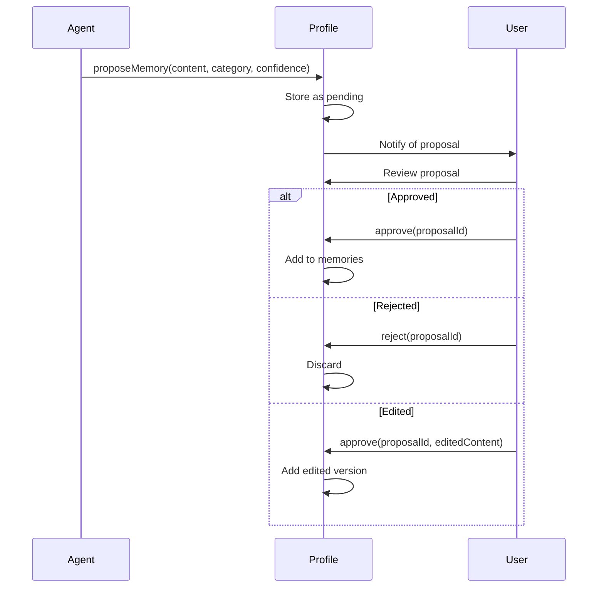

# Core Concepts

This page explains the fundamental building blocks of the a2p protocol.

---

## Decentralized Identifiers (DIDs)

Every actor in a2p has a **DID** — a globally unique, user-controlled identifier.

```
did:a2p:user:local:alice123
did:a2p:agent:local:my-assistant
did:a2p:entity:local:acme-corp
```

### Why DIDs?

| Benefit | Description |
|---------|-------------|
| **User-owned** | No central authority controls your identity |
| **Portable** | Works across platforms and providers |
| **Cryptographic** | Signatures prove ownership |
| **Standard** | W3C specification |

### DID Structure

```
did:a2p:user:local:alice123
│   │   │    └── Unique identifier
│   │   └── Actor type (user, agent, entity)
│   └── a2p method
└── DID scheme
```

---

## Profile Types

a2p supports three profile types:

### Human Profiles

For individual users:

```json
{
  "id": "did:a2p:user:local:alice",
  "profileType": "human",
  "identity": { "displayName": "Alice" },
  "common": { "preferences": { ... } },
  "memories": { ... }
}
```

### Agent Profiles

For AI agents and services:

```json
{
  "id": "did:a2p:agent:local:my-bot",
  "profileType": "agent",
  "identity": { "name": "My Assistant" },
  "capabilities": ["conversation", "code"],
  "operator": { "did": "did:a2p:entity:local:company" },
  "aiActCompliance": { "riskLevel": "limited" }
}
```

### Entity Profiles

For organizations, teams, departments:

```json
{
  "id": "did:a2p:entity:local:acme",
  "profileType": "entity",
  "entityType": "organization",
  "identity": { "name": "Acme Corp" },
  "enforcedPolicies": [ ... ]
}
```

---

## Memory Categories

Memories are organized in namespaced categories:

### Standard Categories (a2p:)

| Category | Description |
|----------|-------------|
| `a2p:preferences` | User preferences (language, style) |
| `a2p:interests` | Topics, hobbies |
| `a2p:professional` | Work-related context |
| `a2p:health` | Health information (sensitive) |
| `a2p:financial` | Financial context (sensitive) |
| `a2p:relationships` | Social connections |
| `a2p:episodic` | Things learned in conversations |

### Extension Categories (ext:)

Third parties can register custom categories:

```
ext:spotify:music.preferences
ext:github:coding.style
```

### Sensitivity Levels

| Level | Description | Default Sharing |
|-------|-------------|-----------------|
| `public` | Safe to share widely | Open |
| `standard` | Normal preferences | With consent |
| `sensitive` | Personal information | Restricted |
| `restricted` | Health, financial | Explicit only |

---

## Consent Policies

Users control access through consent policies.

### Policy Structure

```json
{
  "id": "policy_work",
  "name": "Work Assistant Policy",
  "agentPattern": "did:a2p:agent:local:work-*",
  "allow": [
    "a2p:preferences.*",
    "a2p:professional.*"
  ],
  "deny": [
    "a2p:health.*",
    "a2p:financial.*"
  ],
  "permissions": ["read_scoped", "propose"],
  "validUntil": "2026-01-01T00:00:00Z"
}
```

### Permissions

| Permission | Description |
|------------|-------------|
| `read_public` | Read public info only |
| `read_scoped` | Read allowed categories |
| `read_full` | Read entire profile |
| `propose` | Propose new memories |
| `write` | Direct write (rare) |

### Agent Patterns

| Pattern | Matches |
|---------|---------|
| `did:a2p:agent:local:my-bot` | Exact match |
| `did:a2p:agent:local:work-*` | Wildcard prefix |
| `*` | Any agent |

---

## Memory Proposals

Agents don't write directly to profiles. They **propose** memories.

### Proposal Flow



### Proposal Structure

```json
{
  "id": "prop_abc123",
  "agentDid": "did:a2p:agent:local:assistant",
  "content": "User prefers TypeScript over JavaScript",
  "category": "a2p:professional.preferences",
  "confidence": 0.85,
  "context": "Based on conversation about frameworks",
  "status": "pending",
  "expiresAt": "2025-01-07T00:00:00Z"
}
```

---

## Purpose Specification

Every access request must include a **purpose** (GDPR requirement).

```json
{
  "purpose": {
    "type": "personalization",
    "description": "Tailor responses to your communication preferences",
    "legalBasis": "consent",
    "retention": "session_only",
    "automated": {
      "decisionMaking": false,
      "profiling": false
    }
  }
}
```

### Purpose Types

| Type | Description |
|------|-------------|
| `personalization` | Tailoring responses |
| `recommendation` | Suggesting content |
| `context_enrichment` | Adding context to interactions |
| `analysis` | Understanding patterns |
| `compliance` | Legal requirements |

### Legal Bases

| Basis | When to Use |
|-------|-------------|
| `consent` | User explicitly agreed |
| `contract` | Necessary for service |
| `legal_obligation` | Required by law |
| `legitimate_interests` | Business need, balanced |

---

## Consent Receipts

When access is granted, a **consent receipt** is created:

```json
{
  "receiptId": "rcpt_xyz789",
  "userDid": "did:a2p:user:local:alice",
  "agentDid": "did:a2p:agent:local:assistant",
  "grantedScopes": ["a2p:preferences.*"],
  "deniedScopes": ["a2p:health.*"],
  "purpose": { ... },
  "grantedAt": "2025-12-25T10:00:00Z",
  "expiresAt": "2025-12-26T10:00:00Z"
}
```

This creates an **audit trail** for compliance.

---

## Security Model

### Authentication

All requests are signed:

```
Authorization: A2P-Signature 
  did="did:a2p:agent:local:my-agent",
  sig="<base64-signature>",
  ts="2025-12-25T10:00:00Z",
  nonce="abc123xyz"
```

### Protection Mechanisms

| Mechanism | Purpose |
|-----------|---------|
| **Signatures** | Prove identity |
| **Nonces** | Prevent replay attacks |
| **Timestamps** | Limit validity window |
| **Rate limiting** | Prevent abuse |

---

## Next Steps

- [Architecture](architecture.md) — System design
- [Profiles Spec](../spec/profiles.md) — Full profile specification
- [Consent Spec](../spec/consent.md) — Full consent specification
