# Memories & Proposals

Memories are pieces of information that AI agents learn about users. a2p uses a proposal system to ensure users control what gets stored.

---

## Memory Categories

Memories are organized into namespaced categories:

### Standard Categories (a2p:)

| Category | Description | Sensitivity |
|----------|-------------|-------------|
| `a2p:identity` | Basic identity info | Standard |
| `a2p:professional` | Work, skills, career | Standard |
| `a2p:interests` | Topics, hobbies, preferences | Low |
| `a2p:preferences` | Interaction preferences | Low |
| `a2p:context` | Current focus, recent topics | Low |
| `a2p:health` | Health information | **High** |
| `a2p:financial` | Financial context | **High** |
| `a2p:relationships` | Social connections | **High** |
| `a2p:episodic` | Learned facts from conversations | Standard |

### Extension Categories (ext:)

Third parties can define custom categories:

```
ext:mycompany:preferences
ext:healthcare:conditions
ext:spotify:listening
```

---

## Memory Structure

### Structured Memory

For predefined categories with known schema:

```json
{
  "a2p:professional": {
    "occupation": "Software Engineer",
    "industry": "Technology",
    "skills": ["TypeScript", "Python", "AI/ML"],
    "yearsExperience": 10,
    "currentRole": "Senior Engineer"
  }
}
```

### Episodic Memory

For facts learned from conversations:

```json
{
  "a2p:episodic": [
    {
      "id": "mem_abc123",
      "content": "Prefers TypeScript over JavaScript for new projects",
      "category": "a2p:professional.preferences",
      "confidence": 0.88,
      "source": {
        "type": "agent_proposal",
        "agentDid": "did:a2p:agent:local:copilot",
        "sessionId": "sess_xyz",
        "timestamp": "2025-12-20T14:30:00Z"
      },
      "metadata": {
        "approvedAt": "2025-12-20T14:35:00Z",
        "useCount": 5,
        "lastUsed": "2025-12-25T10:00:00Z"
      }
    }
  ]
}
```

---

## The Proposal System

Agents don't write directly to profiles. They **propose** memories, and users decide.

### Why Proposals?

1. **Accuracy** — Users can correct misunderstandings
2. **Consent** — Nothing stored without explicit approval
3. **Transparency** — Users see what AI "thinks" it learned
4. **Control** — Edit or reject before saving

### Proposal Flow

```mermaid
sequenceDiagram
    participant A as 🤖 Agent
    participant G as 🌐 Gateway
    participant P as 📋 Profile
    participant U as 👤 User

    A->>G: POST /profile/:did/memories/propose
    G->>P: Create proposal
    P->>U: Notification (optional)
    
    Note over U: User reviews proposal
    
    alt Approved
        U->>P: Approve (optional edit)
        P->>P: Add memory
        P->>A: Webhook: proposal.approved
    else Rejected
        U->>P: Reject
        P->>A: Webhook: proposal.rejected
    else Expired
        Note over P: 7 days timeout
        P->>A: Webhook: proposal.expired
    end
```



### Creating a Proposal

=== "TypeScript"

    ```typescript
    import { A2PClient } from '@a2p/sdk';
    
    const client = new A2PClient({ agentDid: 'did:a2p:agent:local:my-agent' });
    
    const proposal = await client.proposeMemory({
      userDid: 'did:a2p:user:local:alice',
      content: 'Prefers concise responses without unnecessary elaboration',
      category: 'a2p:preferences.communication',
      confidence: 0.85,
      context: 'User explicitly requested shorter responses twice'
    });
    
    console.log('Proposal ID:', proposal.id);
    console.log('Status:', proposal.status); // 'pending'
    console.log('Expires:', proposal.expiresAt);
    ```

=== "Python"

    ```python
    from a2p import A2PClient
    
    client = A2PClient(agent_did="did:a2p:agent:local:my-agent")
    
    proposal = await client.propose_memory(
        user_did="did:a2p:user:local:alice",
        content="Prefers concise responses without unnecessary elaboration",
        category="a2p:preferences.communication",
        confidence=0.85,
        context="User explicitly requested shorter responses twice"
    )
    
    print(f"Proposal ID: {proposal.id}")
    print(f"Status: {proposal.status}")  # 'pending'
    ```

### Proposal Structure

```json
{
  "id": "prop_abc123xyz",
  "userDid": "did:a2p:user:local:alice",
  "agentDid": "did:a2p:agent:local:my-agent",
  "content": "Prefers concise responses",
  "category": "a2p:preferences.communication",
  "confidence": 0.85,
  "context": "User explicitly requested shorter responses twice",
  "status": "pending",
  "proposedAt": "2025-12-25T10:00:00Z",
  "expiresAt": "2026-01-01T10:00:00Z"
}
```

---

## Reviewing Proposals

### User Actions

| Action | Result |
|--------|--------|
| **Approve** | Memory added to profile as-is |
| **Edit & Approve** | Memory added with user's edits |
| **Reject** | Proposal discarded |
| **Ignore** | Expires after 7 days |

### Reviewing via SDK

=== "TypeScript"

    ```typescript
    const userClient = new A2PUserClient();
    
    // List pending proposals
    const proposals = await userClient.listProposals({ status: 'pending' });
    
    for (const proposal of proposals) {
      console.log(`From: ${proposal.agentDid}`);
      console.log(`Content: ${proposal.content}`);
      console.log(`Confidence: ${proposal.confidence}`);
    }
    
    // Approve a proposal
    await userClient.reviewProposal(proposal.id, {
      action: 'approve'
    });
    
    // Approve with edits
    await userClient.reviewProposal(proposal.id, {
      action: 'approve',
      editedContent: 'Prefers brief, concise responses'
    });
    
    // Reject
    await userClient.reviewProposal(proposal.id, {
      action: 'reject',
      reason: 'This is not accurate'
    });
    ```

---

## Auto-Approval

For convenience, users can enable automatic approval:

```json
{
  "autoApprove": {
    "enabled": true,
    "conditions": {
      "trustedAgentsOnly": true,
      "minConfidence": 0.9,
      "allowedCategories": [
        "a2p:preferences.*",
        "a2p:interests.*"
      ],
      "deniedCategories": [
        "a2p:health.*",
        "a2p:financial.*"
      ],
      "maxProposalsPerDay": 5,
      "requireReview": "weekly"
    }
  }
}
```

### Auto-Approval Conditions

| Condition | Description |
|-----------|-------------|
| `trustedAgentsOnly` | Only certified or explicitly trusted agents |
| `minConfidence` | Minimum confidence score (0.0-1.0) |
| `allowedCategories` | Categories eligible for auto-approval |
| `deniedCategories` | Categories that always require manual review |
| `maxProposalsPerDay` | Limit to prevent flooding |
| `requireReview` | Periodic review even if auto-approved |

---

## Memory Confidence

Confidence scores indicate how certain the agent is:

| Score | Meaning | Example |
|-------|---------|---------|
| 0.9+ | Very confident | User explicitly stated |
| 0.7-0.9 | Confident | Strong inference from behavior |
| 0.5-0.7 | Moderate | Reasonable inference |
| <0.5 | Low | Guess, should verify |

### Confidence Decay

Memories can decay over time if not reinforced:

```json
{
  "memoryManagement": {
    "confidenceDecay": {
      "enabled": true,
      "halfLife": "180d",
      "minimumConfidence": 0.3
    }
  }
}
```

---

## Memory Consolidation

Multiple related memories can be consolidated:


### Consolidation Triggers

- Manual user action
- Automated when memories conflict
- Periodic cleanup

---

## Deleting Memories

Users can delete any memory:

=== "TypeScript"

    ```typescript
    // Delete specific memory
    await userClient.deleteMemory('mem_abc123');
    
    // Delete all memories from an agent
    await userClient.deleteMemoriesFrom('did:a2p:agent:local:my-agent');
    
    // Delete entire category
    await userClient.deleteCategory('a2p:episodic');
    ```

---

## Best Practices for Agents

### Do

- ✅ Only propose high-confidence memories
- ✅ Provide clear context for why you're proposing
- ✅ Use appropriate categories
- ✅ Respect sensitivity levels
- ✅ Handle rejections gracefully

### Don't

- ❌ Flood users with low-value proposals
- ❌ Propose without sufficient confidence
- ❌ Propose sensitive information without strong signal
- ❌ Re-propose rejected memories

---

## Next Steps

- [Consent & Policies](consent.md) — Control who can access memories
- [Security](security.md) — How memories are protected
