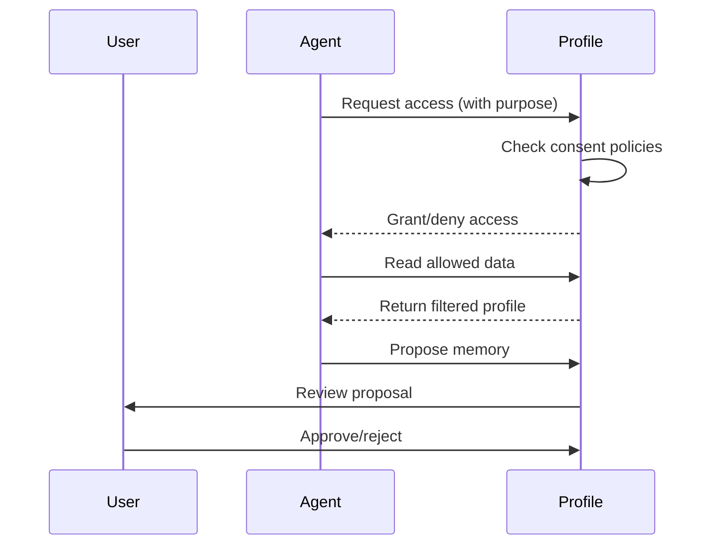

# What is a2p?

**a2p (Agent 2 Profile)** is an open protocol that enables **user-sovereign AI profiles**. It gives users ownership and control of their AI interaction data across all AI agents.

---

## The Core Idea

Think of a2p as a **digital passport for AI interactions**:

| Passport | a2p Profile |
|----------|-------------|
| Owned by you | Owned by you |
| Contains your identity | Contains your preferences |
| Portable across countries | Portable across AI agents |
| You control what to share | You control what to share |

---

## Why a2p Exists

### The Current Problem

When you use AI assistants today:

1. **Your data is siloed** — Each AI has its own copy of your preferences
2. **You don't own it** — The AI company owns your interaction history
3. **It's not portable** — Switch to a new AI? Start from scratch
4. **Privacy is unclear** — Hard to know what's stored or delete it

### The a2p Solution

With a2p:

1. **You own your profile** — Cryptographic ownership via DIDs
2. **It's portable** — Works with any a2p-compatible agent
3. **You control access** — Granular consent policies
4. **Compliance built-in** — GDPR and AI Act requirements native

---

## Key Concepts

### Profiles

A profile contains:

- **Identity** — Display name, pronouns (optional)
- **Preferences** — Language, timezone, communication style
- **Interests** — Topics, hobbies, professional context
- **Memories** — Things agents have learned about you

```json
{
  "id": "did:a2p:user:local:alice",
  "profileType": "human",
  "identity": {
    "displayName": "Alice",
    "pronouns": "she/her"
  },
  "common": {
    "preferences": {
      "language": "en-US",
      "communication": { "style": "concise" }
    }
  },
  "memories": {
    "a2p:professional": {
      "occupation": "Software Engineer"
    }
  }
}
```

### Consent Policies

You define rules for who can access what:

```json
{
  "agentPattern": "did:a2p:agent:local:my-assistant",
  "allow": ["a2p:preferences.*", "a2p:interests.*"],
  "deny": ["a2p:health.*"],
  "permissions": ["read_scoped", "propose"]
}
```

### Memory Proposals

Agents can't just write to your profile. They **propose** memories, and you approve:

1. Agent learns something: "User prefers TypeScript"
2. Agent proposes this as a memory
3. You review the proposal
4. You approve, edit, or reject

---

## How It Works



---

## Who Is It For?

### For Users
- Control your AI interaction data
- Portable preferences across agents
- Easy GDPR rights exercise

### For AI Developers
- Get user context without cold start
- Built-in compliance
- Framework adapters ready

### For Enterprises
- Standardized AI data governance
- Reduced compliance overhead
- Vendor portability

---

## Open & EU-Made

- **License:** EUPL-1.2 (EU open source license)
- **Location:** Developed in Madrid, Spain
- **Values:** Privacy, sovereignty, interoperability

---

## Next Steps

- [Core Concepts](core-concepts.md) — Deeper dive into the protocol
- [Quickstart](../tutorials/quickstart-typescript.md) — Build your first integration
- [Specification](../spec/overview.md) — Full technical details
