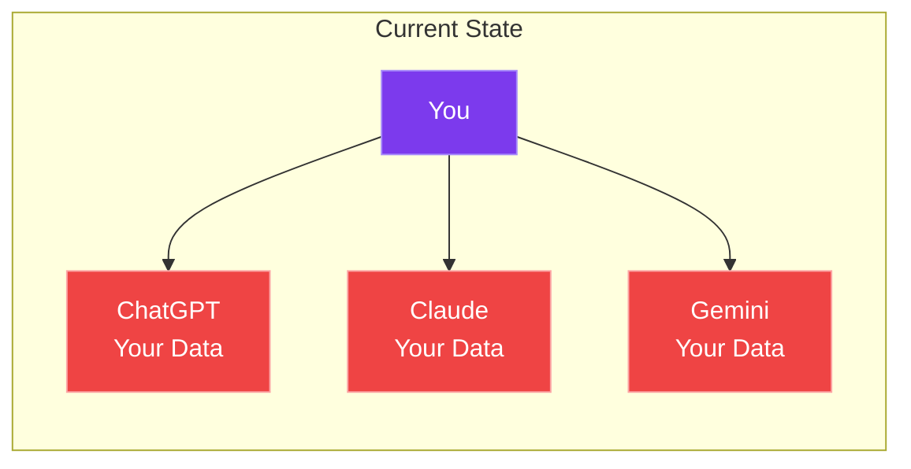
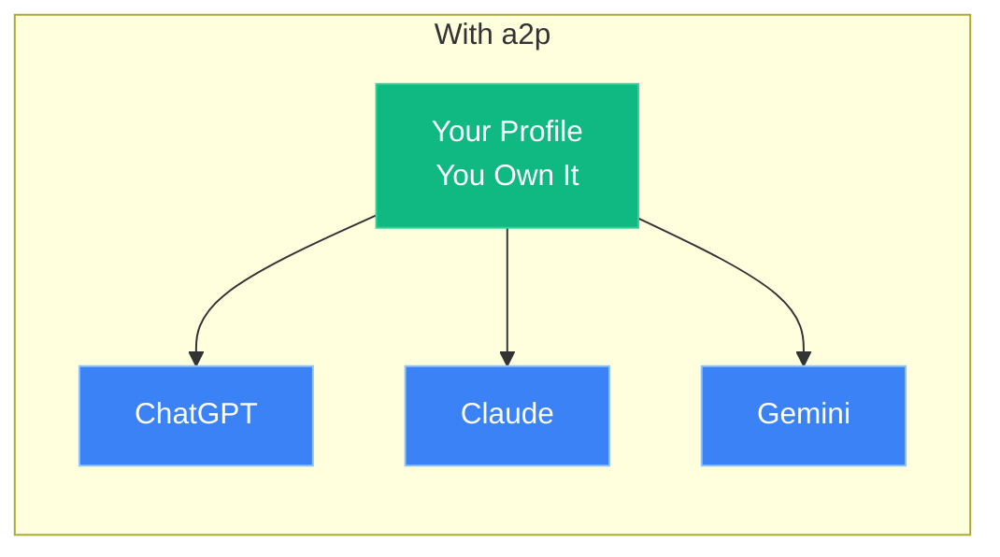

<div class="hero">
  <div class="hero-content">
    <h1>Agent2Profile Protocol</h1>
    <p class="hero-subtitle">
      The open standard for <strong>user-sovereign AI profiles</strong>.<br>
      Your preferences. Your memories. Your control.
    </p>
    <div class="hero-buttons">
      <a href="docs/what-is-a2p/" class="md-button md-button--primary">Get Started</a>
      <a href="spec/overview/" class="md-button">Read the Spec</a>
      <a href="https://github.com/a2p-protocol/a2p" class="md-button">GitHub</a>
    </div>
  </div>
</div>

<div class="features">
  <div class="feature">
    <span class="feature-icon">👤</span>
    <h3>User Ownership</h3>
    <p>Your AI profile belongs to you via decentralized identity. Not to AI companies.</p>
  </div>
  <div class="feature">
    <span class="feature-icon">🔄</span>
    <h3>Portable</h3>
    <p>Take your preferences to any AI agent. Switch providers without losing context.</p>
  </div>
  <div class="feature">
    <span class="feature-icon">🔐</span>
    <h3>Privacy-First</h3>
    <p>Granular consent controls. You decide what each agent can see.</p>
  </div>
  <div class="feature">
    <span class="feature-icon">⚖️</span>
    <h3>Compliant</h3>
    <p>GDPR and EU AI Act requirements built into the protocol.</p>
  </div>
</div>

---

## The Problem

Today, when you use AI assistants, your preferences and context are **trapped in silos**:



- Switch AI providers? **Start from scratch.**
- Want to know what they stored? **Good luck.**
- Exercise your GDPR rights? **Per vendor.**

---

## The Solution

With a2p, **you own your profile** and share it selectively:



- **One profile** that you control
- **Portable** across any compliant agent
- **Granular permissions** per agent
- **Built-in compliance** with EU regulations

---

## Quick Start

=== "TypeScript"

    ```typescript
    import { A2PClient } from '@a2p/sdk';

    const client = new A2PClient({
      agentDid: 'did:a2p:agent:local:my-agent'
    });

    // Request access to user profile
    const profile = await client.getProfile({
      userDid: 'did:a2p:user:local:alice',
      scopes: ['a2p:preferences', 'a2p:interests'],
      purpose: {
        type: 'personalization',
        description: 'Tailor responses to your preferences'
      }
    });

    // Propose a memory
    await client.proposeMemory({
      userDid: 'did:a2p:user:local:alice',
      content: 'Prefers concise responses',
      category: 'a2p:preferences.communication',
      confidence: 0.85
    });
    ```

=== "Python"

    ```python
    from a2p import A2PClient

    client = A2PClient(agent_did="did:a2p:agent:local:my-agent")

    # Request access to user profile
    profile = await client.get_profile(
        user_did="did:a2p:user:local:alice",
        scopes=["a2p:preferences", "a2p:interests"],
        purpose={
            "type": "personalization",
            "description": "Tailor responses to your preferences"
        }
    )

    # Propose a memory
    await client.propose_memory(
        user_did="did:a2p:user:local:alice",
        content="Prefers concise responses",
        category="a2p:preferences.communication",
        confidence=0.85
    )
    ```

---

## How It Works

<div class="how-it-works">
  <div class="step">
    <div class="step-number">1</div>
    <h4>Create Your Profile</h4>
    <p>Set up your a2p profile with your preferences, interests, and context.</p>
  </div>
  <div class="step">
    <div class="step-number">2</div>
    <h4>Set Your Rules</h4>
    <p>Define consent policies: who can access what, for what purpose.</p>
  </div>
  <div class="step">
    <div class="step-number">3</div>
    <h4>Agents Request Access</h4>
    <p>AI agents request access with a declared purpose. You approve or deny.</p>
  </div>
  <div class="step">
    <div class="step-number">4</div>
    <h4>Agents Propose, You Approve</h4>
    <p>Agents suggest new memories. You review and approve before storage.</p>
  </div>
</div>

---

## Framework Adapters

Use a2p with your favorite AI frameworks:

<div class="adapters">
  <a href="adapters/langchain/" class="adapter">
    <strong>LangChain</strong>
    <span>Memory integration</span>
  </a>
  <a href="adapters/openai/" class="adapter">
    <strong>OpenAI</strong>
    <span>Assistants API</span>
  </a>
  <a href="adapters/langgraph/" class="adapter">
    <strong>LangGraph</strong>
    <span>State persistence</span>
  </a>
  <a href="adapters/crewai/" class="adapter">
    <strong>CrewAI</strong>
    <span>Agent memory</span>
  </a>
</div>

---

## Built for Compliance

<div class="compliance-grid">
  <div class="compliance-item">
    <h4>🇪🇺 GDPR</h4>
    <ul>
      <li>Purpose limitation</li>
      <li>Consent management</li>
      <li>Data subject rights</li>
      <li>Audit trails</li>
    </ul>
  </div>
  <div class="compliance-item">
    <h4>🤖 EU AI Act</h4>
    <ul>
      <li>Risk classification</li>
      <li>Transparency obligations</li>
      <li>Human oversight</li>
      <li>Record-keeping</li>
    </ul>
  </div>
</div>

---

## a2p in the Ecosystem

a2p is **complementary** to major protocols and frameworks:

| Protocol/Framework | Focus | Relationship with a2p |
|---------------------|-------|----------------------|
| **A2A** | Agent-to-Agent communication | ✅ Complementary - a2p provides user context for A2A agents |
| **MCP** | AI assistant tool integration | ✅ Complementary - a2p profiles exposed as MCP resources |
| **Solid** | Decentralized data storage | ✅ Infrastructure partner - a2p can use Solid Pods |
| **OpenID Connect** | Authentication | ✅ Complementary - different layer (auth vs profiles) |
| **LangChain** | Agent framework | ✅ Integration - a2p as memory backend |

**Key Message**: a2p doesn't compete with these—it **fills the user profile gap** they all need.

---

## Open Source & EU-Made

<div class="open-source">
  <div class="license">
    <h4>EUPL-1.2</h4>
    <p>European Union Public License - designed for EU legal frameworks</p>
  </div>
  <div class="location">
    <h4>🇪🇺 Made in EU</h4>
    <p>Developed in Madrid, Spain with EU digital sovereignty in mind</p>
  </div>
</div>

---

<div class="cta">
  <h2>Ready to Get Started?</h2>
  <p>Build AI agents that respect user sovereignty.</p>
  <div class="cta-buttons">
    <a href="tutorials/quickstart-typescript/" class="md-button md-button--primary">Start Building</a>
    <a href="https://github.com/a2p-protocol/a2p" class="md-button">View on GitHub</a>
  </div>
</div>
