# Multi-Profile Setup

Learn how to manage multiple profiles for different contexts.

---

## Why Multiple Profiles?

Users may want different "personas" for different contexts:

| Profile | Use Case | Shared Data |
|---------|----------|-------------|
| **Base** | Common preferences | Language, timezone |
| **Work** | Professional AI tools | Skills, role |
| **Personal** | Personal assistants | Interests, hobbies |
| **Health** | Medical AI | Health conditions |

---

## Profile Hierarchy

```mermaid
flowchart TB
    base["📋 Base Profile\ndid:a2p:user:local:alice"]
    
    work["💼 Work\ndid:a2p:user:local:alice:work"]
    personal["🏠 Personal\ndid:a2p:user:local:alice:personal"]
    health["🏥 Health\ndid:a2p:user:local:alice:health"]
    
    base --> work
    base --> personal
    base --> health
```



---

## Creating Sub-Profiles

```typescript
import { A2PUserClient } from '@a2p/sdk';

const client = new A2PUserClient(storage);

// Create base profile first
const baseProfile = await client.createProfile({
  displayName: 'Alice',
  preferences: {
    language: 'en-US',
    timezone: 'Europe/Madrid'
  }
});

// Create work sub-profile
const workProfile = await client.createSubProfile({
  name: 'Work',
  inheritsFrom: baseProfile.id,
  purpose: 'Professional AI interactions',
  overrides: {
    preferences: {
      communication: {
        formality: 'professional',
        style: 'detailed'
      }
    }
  },
  additionalMemories: {
    'a2p:professional': {
      role: 'Senior Engineer',
      company: 'Tech Corp',
      skills: ['TypeScript', 'Python', 'Cloud']
    }
  }
});

// Create personal sub-profile  
const personalProfile = await client.createSubProfile({
  name: 'Personal',
  inheritsFrom: baseProfile.id,
  purpose: 'Personal assistant interactions',
  overrides: {
    preferences: {
      communication: {
        formality: 'casual',
        humor: true
      }
    }
  }
});

console.log('Work profile:', workProfile.id);
// Output: did:a2p:user:local:alice:work
```

---

## Inheritance Rules

### What Gets Inherited

| Data | Inherited | Can Override |
|------|-----------|--------------|
| `identity.displayName` | ✅ | ✅ |
| `common.preferences` | ✅ | ✅ (merge) |
| `memories` | ❌ | N/A (separate) |
| `accessPolicies` | ✅ | ✅ (add more restrictive) |

### Override Example

```typescript
// Base profile
{
  "preferences": {
    "language": "en-US",
    "communication": {
      "style": "concise"
    }
  }
}

// Work profile override
{
  "overrides": {
    "preferences": {
      "communication": {
        "formality": "professional"
      }
    }
  }
}

// Effective work preferences (merged)
{
  "language": "en-US",           // inherited
  "communication": {
    "style": "concise",          // inherited
    "formality": "professional"  // override
  }
}
```

---

## Profile-Specific Policies

Each sub-profile can have its own policies:

```typescript
// Work profile: allow professional data
await client.createPolicy({
  profileId: workProfile.id,
  name: 'Work AI Access',
  agentPattern: 'did:a2p:agent:local:work-*',
  allow: ['a2p:professional.*', 'a2p:preferences.*'],
  deny: ['a2p:personal.*', 'a2p:health.*']
});

// Personal profile: allow interests, deny work
await client.createPolicy({
  profileId: personalProfile.id,
  name: 'Personal AI Access',
  agentPattern: '*',
  allow: ['a2p:interests.*', 'a2p:preferences.*'],
  deny: ['a2p:professional.*']
});
```

---

## Switching Profiles

### For Agents

Agents should request the appropriate profile:

```typescript
// Agent requesting work context
const access = await agentClient.requestAccess({
  userDid: 'did:a2p:user:local:alice:work',  // Specific sub-profile
  scopes: ['a2p:professional'],
  purpose: { ... }
});

// Agent requesting personal context
const access = await agentClient.requestAccess({
  userDid: 'did:a2p:user:local:alice:personal',
  scopes: ['a2p:interests'],
  purpose: { ... }
});
```

### User Selection

Users can indicate which profile to use:

```typescript
// User sets default profile for an agent
await client.setAgentProfilePreference({
  agentDid: 'did:a2p:agent:local:work-copilot',
  preferredProfile: 'did:a2p:user:local:alice:work'
});
```

---

## Managing Sub-Profiles

### List Sub-Profiles

```typescript
const subProfiles = await client.listSubProfiles();

for (const sub of subProfiles) {
  console.log(`${sub.name}: ${sub.id}`);
}
```

### Update Sub-Profile

```typescript
await client.updateSubProfile(workProfile.id, {
  overrides: {
    preferences: {
      communication: { verbosity: 'detailed' }
    }
  }
});
```

### Delete Sub-Profile

```typescript
await client.deleteSubProfile(workProfile.id);
// Base profile and other sub-profiles unaffected
```

---

## Best Practices

### Profile Organization

- **Base profile**: Only common, non-sensitive preferences
- **Work profile**: Professional context, company policies
- **Personal profile**: Interests, personal preferences
- **Health profile**: Medical info with strict policies

### Policy Strategy

```typescript
// Base profile: restrictive default
{ "deny": ["a2p:*"], "allow": ["a2p:preferences.language"] }

// Sub-profiles: context-specific access
// Work: professional categories
// Personal: interests categories
// Health: only verified medical agents
```

---

## Next Steps

- [Consent & Policies](../documentation/consent.md) — Advanced policy configuration
- [Security](../documentation/security.md) — Protecting sensitive profiles
